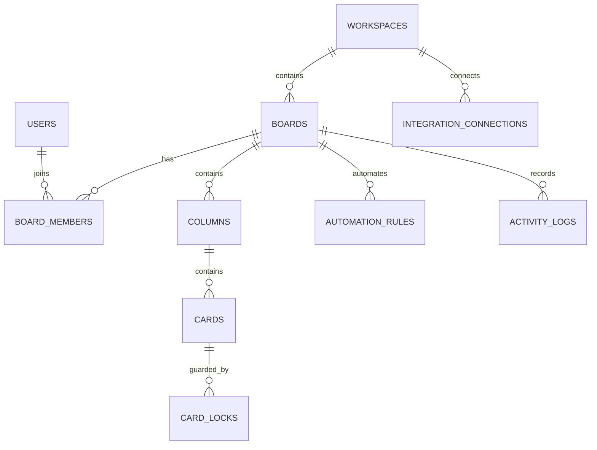

# Database design

## Core transactional entities

### users

- `id`
- `email`
- `name`
- `password_hash`
- `avatar_url`
- `totp_enabled`
- `created_at`

### workspaces

- `id`
- `name`
- `created_by`
- `created_at`

### boards

- `id`
- `workspace_id`
- `title`
- `description`
- `created_by`
- `created_at`
- `updated_at`

### board_members

- `board_id`
- `user_id`
- `role`
- `invited_at`

### columns

- `id`
- `board_id`
- `title`
- `position`
- `wip_limit`
- `created_at`
- `updated_at`

### cards

- `id`
- `column_id`
- `title`
- `description_doc_id`
- `position`
- `status`
- `created_by`
- `assignee_id`
- `due_date`
- `started_at`
- `completed_at`
- `created_at`
- `updated_at`

### card_locks

- `id`
- `card_id`
- `field_name`
- `holder_user_id`
- `expires_at`
- `created_at`

### automation_rules

- `id`
- `board_id`
- `name`
- `trigger_type`
- `conditions_json`
- `actions_json`
- `is_enabled`
- `created_by`
- `created_at`
- `updated_at`

### integration_connections

- `id`
- `workspace_id`
- `provider`
- `encrypted_credentials`
- `created_by`
- `created_at`

### activity_logs

- `id`
- `board_id`
- `actor_id`
- `event_type`
- `entity_type`
- `entity_id`
- `payload`
- `created_at`

## Ordering strategy

Cards and columns are sorted by `position ASC`.

Recommended implementation:

- initialize with wide gaps such as `1000`, `2000`, `3000`;
- when inserting between neighbors, use midpoint / fractional indexing;
- when gaps become too small, compact the affected list inside a transaction;
- emit a revisioned board event after commit so all clients reconcile to the same order.

## Search and analytics support

### Search

Maintain indexed searchable fields for:

- title
- description snapshot
- labels
- assignee
- due date
- board / column / status metadata

Implementation options:

- PostgreSQL `tsvector` for MVP;
- separate search index if advanced scale is needed.

### Analytics

Activity logs serve as the event stream for operational metrics.

Two practical approaches:

- Postgres materialized views for cycle time, throughput, and burndown;
- append-only event export to ClickHouse for heavier analytical workloads.

## Transactional move example

```sql
BEGIN;

UPDATE cards
SET column_id = $1,
    position = $2,
    updated_at = NOW()
WHERE id = $3;

INSERT INTO activity_logs (id, board_id, actor_id, event_type, entity_type, entity_id, payload, created_at)
VALUES ($4, $5, $6, 'card.moved', 'card', $3, $7::jsonb, NOW());

COMMIT;
```

## ER diagram


